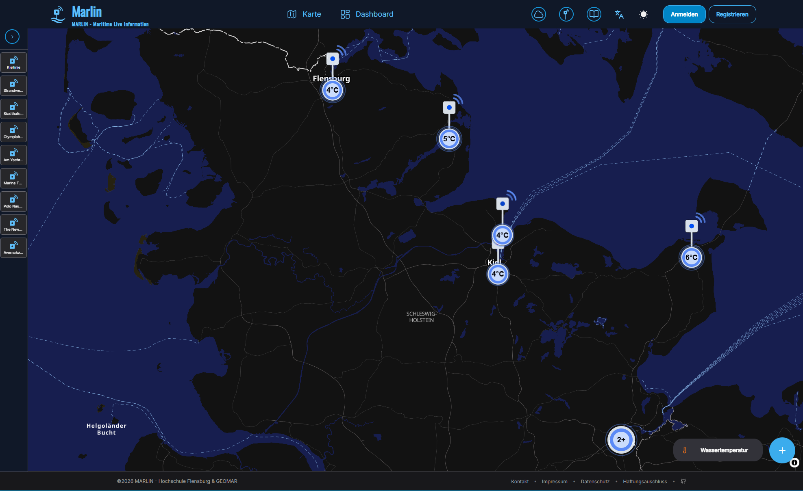

# MARLIN - Frontend-Projekt

Dieses Projekt ist im Rahmen unseres Masterstudiums in Angewandter Informatik zwischen der Hochschule Flensburg und dem GEOMAR entstanden. Es beinhaltet den Frontend-Teil, der für die Visualisierung verantwortlich ist. 




## Installation

1. Abhängigkeiten installieren.

``` bash
npm install
```

2. Gegebenenfalls die Backend-Url anpassen unter config/environment.ts.

``` bash
  dev: {
    apiUrl: 'http://localhost:8080',
    ...
  },
```

3. Webapp starten -w, Android -a, iOS -i

``` bash
npx expo start -w
```

Das Projekt nutzt den Expo push notifications Service, der wie folgt eingerichtet werden muss: https://docs.expo.dev/push-notifications/overview/